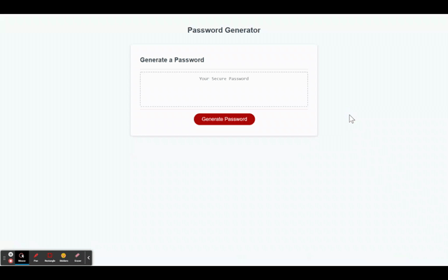

# 🏗️ Project title
 ## Password Generator
 

# 📖 Description
### A simple yet carefully programmed secure, concise, accurate and pretty much a real world web page to generate secured passwords. 

 

## 🏆 A list of features

- Professional standard password criteria.

- Fully customizable password.

- Support password up to 128 characters length.

- Support lowercase, uppercase, numeric and special characters.

- Password automatic and randomly generated based on user input to match user criteria.

- Password validation: at least one character from selected types will be included, excluded password starts or ends with space.

 

# 🏗️ Screenshot

## The following image shows the web application's appearance and functionality:
 

### Sample website intro video.

 

# 📝 Installation

The link to the deployed site:

[Deployed site](https://devrayhe.github.io/password-generator/)

The link to the repo url:

[Repo url](https://github.com/DevRayHE/password-generator.git)

